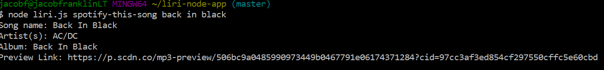
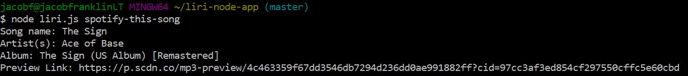
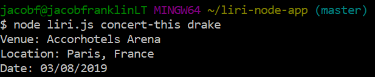
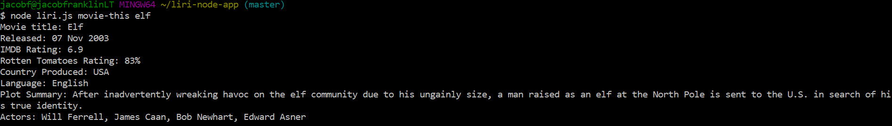
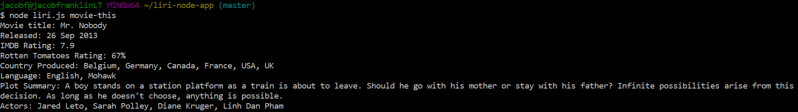
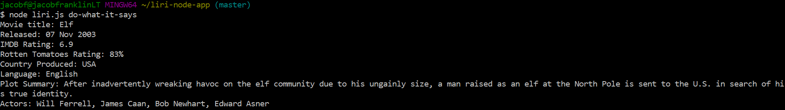

# LIRI Node App

### Introduction
LIRI is a Node-based javascript application that takes in parameters via the command line and returns data to the user. LIRI stands for Language Interpretation and Recognition Interface.  
In this README, I will review the basic functionality of LIRI, as well as include screenshots of the application in use.  

### Overview
LIRI utilizies three external APIs:
* Spotify to return song data
* Bands in Town to return concert data
* OMDB to return movie data  
In addition, LIRI uses the following Node packages:
* Node-Spotify-API
* Axios
* Moment
* DotEnv
Users interact with the application through their command line interface (CLI). The above APIs are called based on the parameters passed through the CLI.

### Commands
All requests should be made from within your local LIRI directory (or whichever directory your Node packages are installed), using the base command 'node liri.js'. 

#### Spotify
To make a call to the Spotify API, pass in 'spotify-this-song' followed by the song you would like to search, after the LIRI base command. For example, to search for 'Back In Black', you would enter:
* 'node liri.js spotify-this-song back in black'
* This will return the song name, the artist, album, and preview link from Spotify for the song entered.
* Below is a screenshot of this command with its response:  

* If no song is entered, it will default to 'The Sign' by Ace of Base.
* Below is a screen of the default response:  

#### Bands in Town
To make a call to the Bands in Town API, pass in 'concert-this' followed by the band you would like to search, after the LIRI base command. For example, to search for 'Drake', you would enter:  
* 'node liri.js concert-this drake'
* This will return the venue, location, and date of any upcoming concerts from this artist.
* Below is a screenshot of this command with its response:  

#### OMDB
To make a call to the OMDB API, pass in 'movie-this' followed by the movie you would like to search, after the LIRI base command. For example, to search for 'Elf', you would enter:
* 'node liri.js movie-this elf'
* This will return the movie title, its release date, the IMDB and Rotten Tomatoes rating, production country, language, plot summary, and actors.
* Below is a screenshot of this command with its response:  

* If no movie is entered, it will default to 'Mr. Nobody'.
* Below is a screenshot of the default response:  

#### File System Command
In addition to making the above commands through the liri.js script, the LIRI app can also call commands through a linked text file using the built in File System.   
In this case, the linked text file is 'Random.txt'.  
In order to access the text file, pass in 'do-what-it-says' after the LIRI base command. For example:  
* 'node liri.js do-what-it-says'
* The text file should contain an API command from above, followed by a comma, and the variable you would the API to call in quotes. For example:  

* Below is an example of the response from above:  

* Below are examples of this command being used to trigger the Spotify and OMDB APIs:  
  
  

